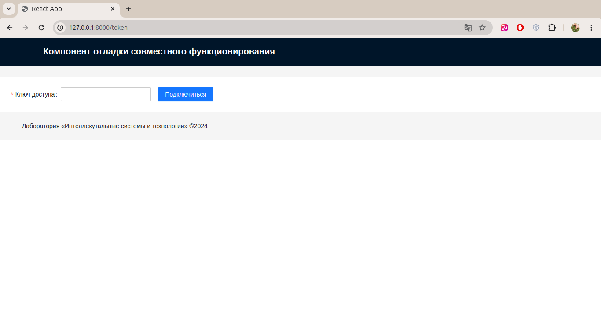
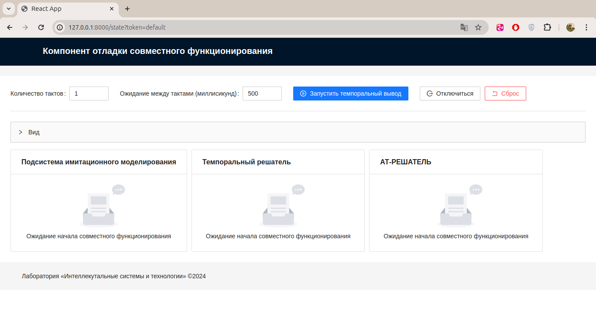
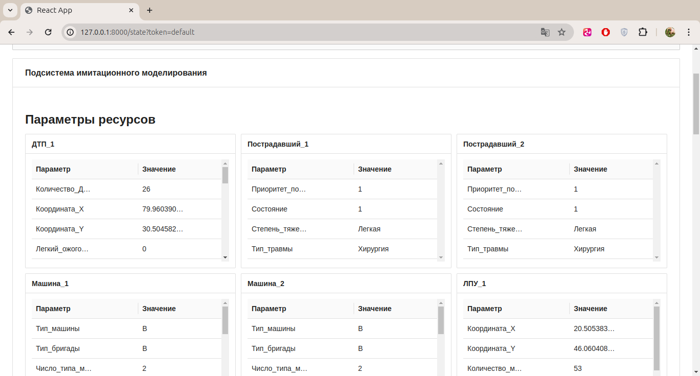
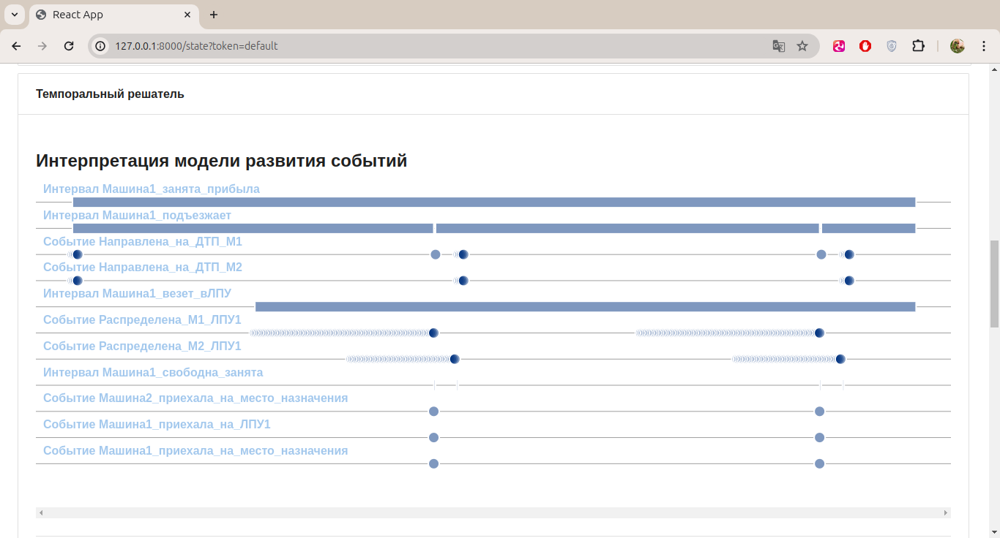
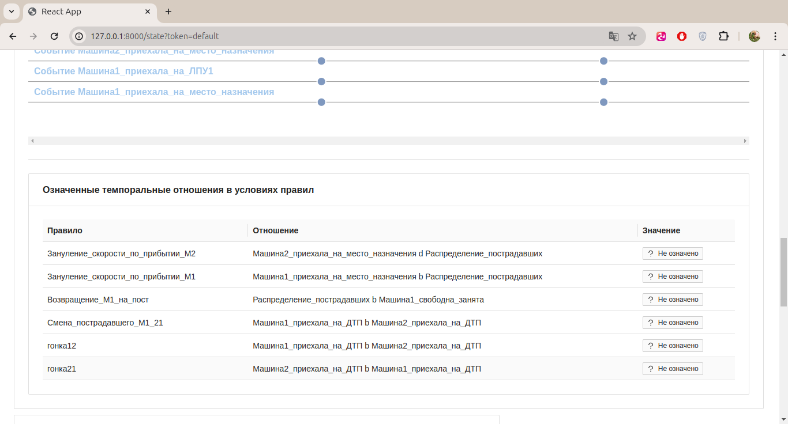
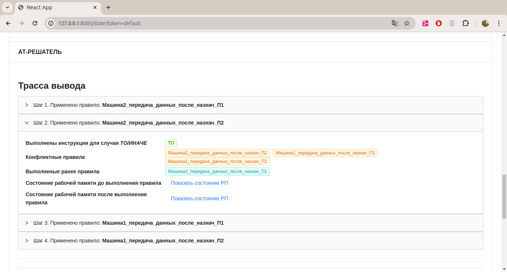
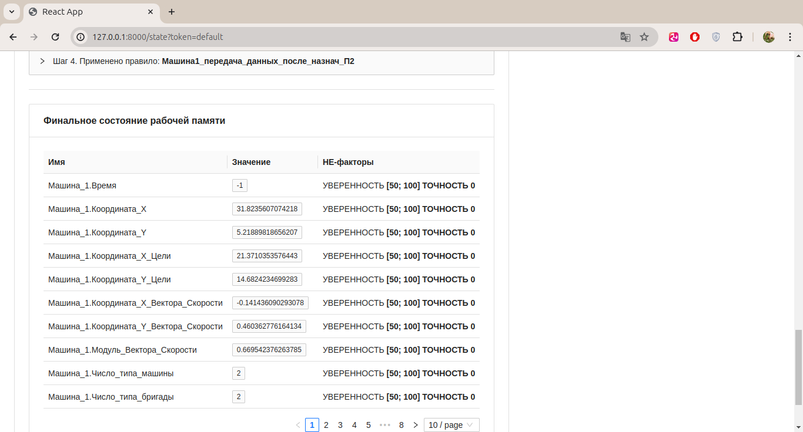

# Пример функционирования базовых компонентов для прототипов динамических ИЭС (комплекс АТ-ТЕХНОЛОГИЯ)

## Состав

В данный пример входят следующие программные компоненты:

1. Брокер сообщений между компонентами ([репозиторий](https://github.com/grigandal625/AT_QUEUE.git))
2. АТ-РЕШАТЕЛЬ ([репозиторий](https://github.com/grigandal625/AT_SOLVER.git)) 
3. Темпоральный решатель ([репозиторий](https://github.com/grigandal625/AT_TEMPORAL_SOLVER.git))
4. Заглушка подсистемы имитиционного моделирования* ([репозиторий](https://github.com/grigandal625/AT_SIMULATION_MOCKING.git))
5. Классная доска ([репозиторий](https://github.com/grigandal625/AT_BLACKBOARD.git))
6. Средства поддержки совместного функционирования подсистемы ИМ, темпорального решателя и АТ-РЕШАТЕЛЯ + компонент отладки совместного функционирования ([репозиторий](https://github.com/grigandal625/AT_JOINT.git))
7. Кофигуратор ([репозиторий](https://github.com/grigandal625/AT_CONFIGURATOR.git))

## Установка и запуск

1. Установить `docker` и плагин `docker compose`
2. Выполнить `docker compose build`
3. Запустить `docker compose up -d`

После того, как все компоненты запустятся, по адресу [http://127.0.0.1:8000](http://127.0.0.1:8000) появится интерфейс компонента отладки совместного функционирования

Для остановки выполнить `docker compose down`

## Информационные ресурсы

Текущая конфикурация прототипа ([src/config.yaml](./src/config.yaml)):

```yaml
auth_token: default
config:
  ATSolver: # конфигурация АТ-РЕШАТЕЛЯ
    kb:
      path: /src/TrafficAccidentsKB.kbs # Файл БЗ
  ATTemporalSolver: # конфигурация темпорального решателя
    kb:
      path: /src/TrafficAccidentsKB.kbs # Файл БЗ
  ATSimulationMocking: # конфигурация заглушки подсистемы ИМ
    sm_run:
      path: /src/ResourceParameters.xml # файл прогона ИМ
  ATJoint: # конфигурация компонента поддержки совместного функционирования
    at_simulation: ATSimulationMocking # имя компонента для отправки сообщений, предназначенных подсистеме ИМ (по умолчанию ATSimulation)
```

Обратите внимание, что для файлов указан абсолютный путь формата `/src/*`, поскольку для docker-контейнеров будет смонтирован том (volume) из папки [./src/](./src/) в папку `/src/` (см. [compose.yaml](./compose.yaml) строки 7-8)

Текущая тестовая база знаний в формате расширенного ЯПЗ находится здесь - [src/TrafficAccidentsKB.kbs](./src/knowledge_base.xml). Можно также указать файл БЗ в формате .json и xml.

Для того, чтобы попробовать совместное функционирование со своими файлами прогона модели и БЗ, необходимо:

1. Положить файлы БЗ и прогона модели в папку [./src/](./src/)
2. При необходимости поменять имена этих файлов в конфигурации [src/config.yaml](./src/config.yaml)
3. Остановить `docker compose down`
4. Запустить `docker compose up -d`

## Использование компонента отладки совместного функционирования

После корректного запуска, по адресу [http://127.0.0.1:8000](http://127.0.0.1:8000) появится интерфейс компонента отладки совместного функционирования



Ключ доступа указан в конфигурации прототипа в поле `auth_token`. По умолчанию - значение ключа - `default`.

После ввода ключа и нажатия кнопки `Подключиться`, откроется экран совместного функционирования.



В верхней панели можно задать параметры совместного функционирования, а также запустить/остановить/сбросить процесс совместного функционирования.

В нижних панелях показаны результаты функционирования компонентов:

1. Подсистемы имитационного моделирования (в данном случае, заглушки):

- Параметры ресурсов, поступающих в рабочую память (классную доску)



2. Темпорального решателя:

- Визуализация интепретации модели развития событий в виде временной диаграммы (только для интервалов и событий, которые возникли хотя бы один раз)



- Результаты сопоставления отношений логики Аллена в условиях правил:



3. АТ-РЕШАТЕЛЯ

- Трасса вывода



- Финальное состояние рабочей памяти

